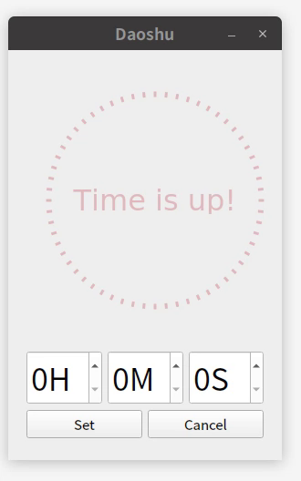

A count-down timer written in C++ and Qt5.

## Why

I am not happy with any of the timer apps on my system, so I reinvented the wheel. Why not?

> Tested only on Ubuntu 18.10, your mileage may vary.

## Install with `conan`

* Set up remote: https://bintray.com/jzien/conan
* `conan install --build missing  -r jzien daoshu/0.0.3@jzien/dev` (assuming that you have set the remote name as `jzien` in the previous step)
* Click `activities` in Gnome and search for `daoshu`.


## Build from source manually

### Compile

```sh
cd daoshu
mkdir build
cd build
conan install --build missing ..
conan build ..
```

### Run

```sh
bin/daoshu
```

## Screencast




## Known issues

* Qt5 looks strange in a multiple-display setting, when the displays don't have the same resolution.

## Todo: 

* Package and upload to snapcraft
